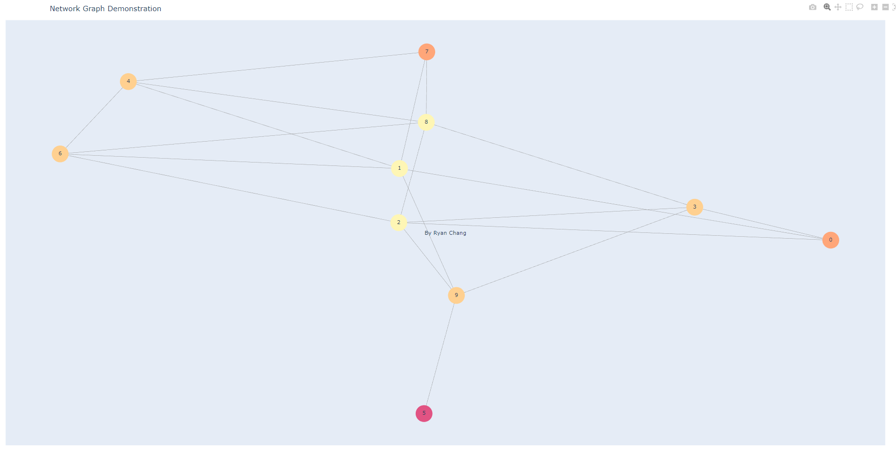

# Social_Network_Program
This program is a social networking system that allows users to interact with each other by adding friends and getting recommendations for new friends based on mutual friends. The program reads two input files: one containing the profiles of members and the other containing their friendship connections. It then creates a graph based on the friendship connections and calculates the similarity scores between members.

## Features
- Show a member's information
- Show the number of friends of a member
- Show a member's list of friends
- Recommend a friend for a member
- Search members by country
- Add a friend
- Remove a friend
- Show the graph
- Save changes

## Usage
Once the program is running, you will see a menu with different options. Enter the corresponding number to select an option.

1. Show a member's information
Selecting this option allows you to display the information of a specific member. You will be prompted to enter the member ID, and the program will show the member's first name, last name, email, country, and the number of friends they have.

2. Show a member's number of friends
This option displays the number of friends a specific member has. Enter the member ID when prompted, and the program will show the count of friends for that member.

3. Show a member's list of friends
By choosing this option, you can view the list of friends for a particular member. Enter the member ID, and the program will display the IDs and names of the member's friends.

4. Recommend a friend for a member
This option provides a friend recommendation for a member. Enter the member ID, and the program will suggest a friend based on mutual connections and similarity scores.

5. Search members by country
Selecting this option allows you to search for members by country. Enter the name of the country, and the program will display the members from that country.

6. Add friend
This option lets you add a friend for a member. You need to enter the member IDs of the two individuals you want to connect as friends. The program will update the friendship connections and recalculate the similarity scores.

7. Remove friend
Choose this option to remove a friend from a member's friend list. Enter the member IDs of the two friends you want to disconnect. The program will update the friendship connections and recalculate the similarity scores.

8. Show graph
This option displays a graph representation of the members and their friendship connections. The graph visualization provides a visual overview of the social network.

9. Save changes
By selecting this option, you can save the changes made to the friendship connections file. The updated connections will be saved for future use.
